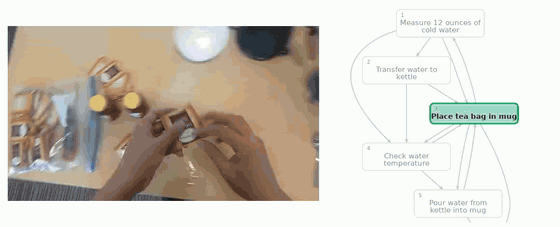

# VidParse: Online Parsing of Egocentric Procedures Like a Pro

[**Anubhav Gupta**](https://learn2phoenix.github.io)<sup>1</sup> · [**Archit Kambhamettu**](https://architkam.github.io/)<sup>1</sup> · [**Vatsal Agarwal**](https://vatsalag99.github.io/)<sup>1</sup> · [**Pulkit Kumar**](https://www.cs.umd.edu/~pulkit/)<sup>1</sup> · [**Abhinav Shrivastava**](http://www.cs.umd.edu/~abhinav/)<sup>1</sup>

<sup>1</sup>University of Maryland, College Park <br>
**ECCV 2026** <br>

<a href='https://arxiv.org/abs/TODO-arxiv-id'></a>
<a href='https://learn2phoenix.github.io/VidParse'></a>
<a href='https://github.com/robert80203/EgoPER_official'></a>

<p align="center">
  <a href="https://learn2phoenix.github.io/VidParse">
    
  </a>
</p>

<p align="center"><sub>Tea, parsed online. Filled boxes are steps already committed, the
highlighted box is the current one. First 45 seconds, playback sped up 3&times;.
<a href="https://learn2phoenix.github.io/VidParse">Full version on the project page.</a></sub></p>

---

## Overview

VidParse turns a streaming first-person video into an ordered sequence of action
steps, **online and without a single gradient update**. There is no training
loop in this repository, and no checkpoint to download, because the method never
learns any parameters of its own.

Three ideas, in the order the pipeline applies them:

1. **Manipulation-Anchored Features (MAFs).** A frozen DINOv2 ViT-L/14 gives
   patch tokens; a frozen hand–object detector gives the interaction box. We
   average only the patch tokens inside that box. The result is a training-free
   masked-attention mechanism that looks at what the hands are doing instead of
   at the kitchen behind them.
2. **Training-free boundary detection.** A Gaussian-tapered checkerboard kernel
   slides down the diagonal of an online temporal similarity matrix. Peaks in
   the resulting novelty signal are action boundaries. Nothing is fitted; the
   detector sees each frame once.
3. **Graph-constrained beam search.** Segments are scored against k-means action
   prototypes, then decoded by a beam search that may only follow edges of a
   task graph induced from the training sequences. Transitions the procedure
   does not allow are assigned infinite cost and pruned.

> **Scope.** This release covers **EgoPER**. Every EgoPER number in the paper
> reproduces from this code — see [Reproduction](#reproduction).

## Results on EgoPER

Frame accuracy excluding background, edit distance, and segmental F1 at IoU
{0.1, 0.25, 0.5}, over the 53 test videos of the ProTAS split.

| Method | Inference | Train-free | Acc | Edit | F1@0.1 | F1@0.25 | F1@0.5 |
|---|---|---|---|---|---|---|---|
| MS-TCN | offline | ✗ | 87.52 | 92.34 | 92.60 | 91.81 | 86.12 |
| MS-TCN | online | ✗ | 25.40 | 44.81 | 44.09 | 31.78 | 15.72 |
| ProTAS | online | ✗ | 76.61 | 65.50 | 64.26 | 62.59 | 51.31 |
| **VidParse** | **online** | **✓** | **80.69** | **88.69** | **91.14** | **88.53** | **77.61** |

Per recipe, from the same run:

| | coffee | oatmeal | pinwheels | quesadilla | tea |
|---|---|---|---|---|---|
| Acc | 75.82 | 80.40 | 74.58 | 83.58 | 86.42 |
| Edit | 76.45 | 91.57 | 81.78 | 91.90 | 96.74 |
| F1@0.5 | 73.37 | 69.70 | 57.94 | 89.71 | 91.97 |

What the representation buys, with the decoder held fixed:

| Representation | MAF | Level | Acc | Edit | F1@0.5 |
|---|---|---|---|---|---|
| DINOv2 ViT-L, full frame | ✗ | frame | 69.09 | 82.68 | 61.42 |
| DINOv2 ViT-B | ✓ | frame | 78.25 | 88.68 | 73.46 |
| EgoVLPv2 | ✗ | clip | 53.40 | 62.75 | 43.66 |
| EgoVLPv2 | ✓ | clip | 60.11 | 70.61 | 52.10 |
| EgoVLPv2 | ✗ | frame | 78.10 | 89.35 | 73.02 |
| EgoVLPv2 | ✓ | frame | 80.32 | 91.46 | 77.48 |
| **DINOv2 ViT-L (ours)** | **✓** | **frame** | **80.69** | **88.69** | **77.61** |

Beam width against accuracy:

| B | Acc | Edit | F1@0.5 |
|---|---|---|---|
| 1 | 58.51 | 77.50 | 52.08 |
| 3 | 76.30 | 86.03 | 72.44 |
| 5 | 78.47 | 86.89 | 74.47 |
| **10** | **80.69** | **88.69** | **77.61** |

## Install

```bash
git clone https://github.com/learn2phoenix/VidParse.git
cd VidParse
python -m venv .venv && source .venv/bin/activate
pip install -r requirements.txt
```

Python 3.10+. The pipeline is CPU-only — a GPU is needed only to extract
features (step 0 below), not to parse. `pygraphviz` needs Graphviz headers
(`apt install graphviz libgraphviz-dev` or `brew install graphviz`).

## Data

[EgoPER](https://github.com/robert80203/EgoPER_official) (Lee et al., CVPR 2024),
which we do not redistribute. We use the 213 normal videos and the splits of
ProTAS, at 10 fps. Lay it out as:

```
<DATA_ROOT>/
  annotation.json
  Videos/                                           # raw mp4s; needed for feature extraction only
  hod/<video_id>/detections.json                    # hand-object detections
  feats_dinov2_hod_enclosed_10fps/<video_id>.npy    # MAFs, one (T, 1024) array per video
  splits/combined_train.txt, combined_test.txt
```

Point `data.root` in the config at `<DATA_ROOT>` and the rest resolves relative
to it.

### Step 0 — features

MAFs are the only input the parser needs. `scripts/extract_maf_features.py`
implements the recipe: run the frozen
[hand–object detector](https://github.com/ddshan/hand_object_detector) to get
per-frame boxes, take the minimum spanning box over hands and active objects,
and average the DINOv2 ViT-L/14 patch tokens that intersect it. Frames with no
detection above `conf_thresh` fall back to the full-frame mean.

## Run

One config file, one command:

```bash
python run.py --config configs/egoper.json --stage all
python run.py --config configs/egoper.json --stage parse --workers 16
```

Stages run in order and each skips work already on disk, so an interrupted run
resumes:

| stage | what it does | output |
|---|---|---|
| `graph` | induce the task graph and transition probabilities from the **training** split | `egoper_task_graphs.json`, `transition_probs.json` |
| `prototypes` | k-means action prototypes and micro-prototypes per recipe | `prototypes/` |
| `scores` | score training segments against prototypes; collect duration/offset statistics | `segment_scores/`, `stats/` |
| `parse` | **the method**: online boundary detection + graph-constrained beam search on each test video | `parses/` |
| `eval` | segmentation metrics, per-recipe and overall | `report.xlsx` |

`--dry-run` prints the exact commands without touching anything. `--workers`
defaults to cores − 1.

Every setting the paper varied lives in `configs/egoper.json`, and each section
of that file carries a `_note` saying what its knobs do. Nothing is hidden in the
code: the runner reads the config and passes every value explicitly.

## Reproduction

Every EgoPER row above was re-measured from this code on Python 3.13.7 (the
paper ran 3.11.9) and matches the published value to the precision the paper
prints — the main row across all 53 test videos and all five recipes, every
feature-ablation row, and the whole beam-width sweep. Prototype arrays match the
archived ones at `max |Δ| = 0`.

The rows we did **not** re-run are the MS-TCN and ProTAS baselines; those come
from the ProTAS codebase, not this one.


**The task graph is induced from the training split.** "Training-free" means no
gradient updates and no learned parameters — not that the method sees no
training data. Prototypes and the task graph are both built from training
videos; test videos inform neither.

**Two config knobs are dataset-specific priors, not general machinery.** The
config names actions explicitly:

```json
"bg_suppress_trigger": "Microwave for X seconds",
"bridge_start": "Put bowl in microwave",
"bridge_end":   "Remove bowl from microwave"
```

These bridge a step whose visual evidence is a closed microwave door — the
failure mode the paper's Limitations section names. Set them to `null` to turn
the rule off. They apply to one recipe (oatmeal) and are inert elsewhere.


## Repository layout

```
run.py                       config-driven local runner
configs/egoper.json          the published EgoPER settings
vidparse/
  parse.py                   online boundary detection + graph-constrained beam search
  prototypes.py              k-means action prototypes
  generate_segment_scores.py segment-to-prototype scoring
  task_graphs.py             task graph induction
  build_transition_probs.py  transition statistics
  decoding_components.py     beam search cost terms
  matching_utils.py          shared matching helpers
  segmentation_metrics.py    Acc / Edit / F1@k
  evaluate.py                per-recipe and overall report
scripts/extract_maf_features.py
tests/test_pipeline.py       kernel shape, novelty peaks, config completeness
```

## Citation

```bibtex
@inproceedings{gupta2026vidparse,
  title     = {VidParse: Online Parsing of Egocentric Procedures Like a Pro},
  author    = {Gupta, Anubhav and Kambhamettu, Archit and Agarwal, Vatsal
               and Kumar, Pulkit and Shrivastava, Abhinav},
  booktitle = {European Conference on Computer Vision (ECCV)},
  year      = {2026}
}
```

## Acknowledgments

Supported in part by NSF CAREER Award #2238769 to Abhinav Shrivastava. We thank
the authors of DINOv2, the hand–object detector, ProTAS and EgoPER, whose
released models and data this work builds on.

## License

MIT, for the code in this repository. The datasets and the frozen models it
calls carry their own licenses.
